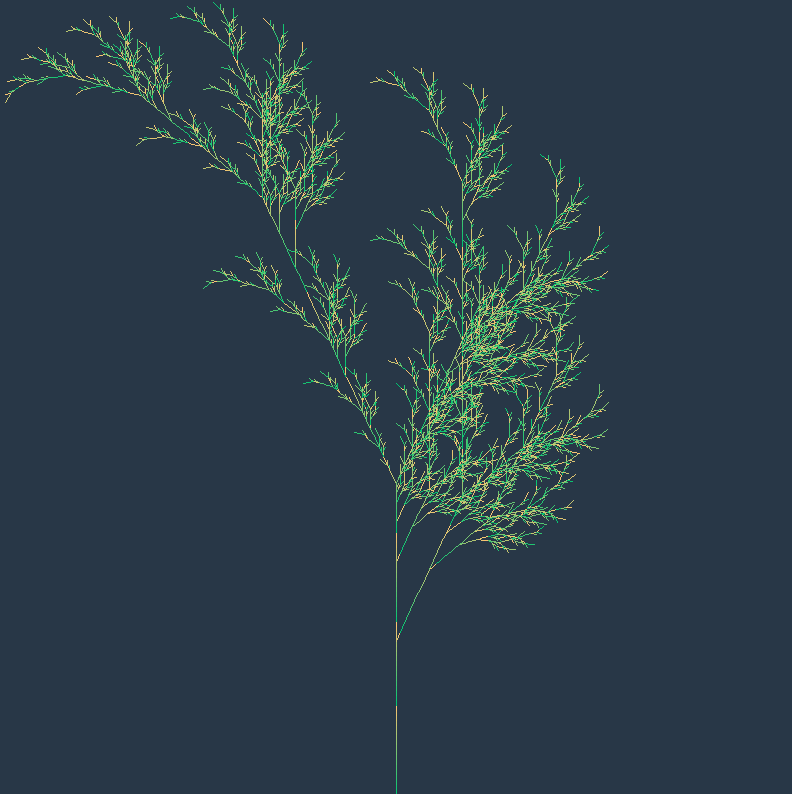
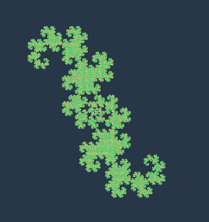

# L-System
[L-System](https://en.wikipedia.org/wiki/L-system) is a very interesting algorithm that consist of modify an axiom string by simple rules. The more the algorithm is repeated the more complex the structure becomes. The algorithm can be very slow with many repetitions, that's why i decide to set a maxDepth in json files.

Check out the wiki page or `/config` folder to see some examples and try making your own :)

To be sure that all requirements is downloaded, please do :
`pip3 install -r requirements.txt`

To launch one exemple :
`python3 LSystem.py configs/dragonCurve.json`

# Some screens

<p align="center">
  
</p>

<p align="center">
  
</p>


If you want making your json file, please follow this structure :
```
{
    "width" : int,
    "height" : int,
    "x" : int,
    "y" : int,
    "size" : int,
    "angle" : int,
    "axiom" : string,
    "rules":
    {
        char : string,
        char : string
    },
    "maxDepth" : int
}